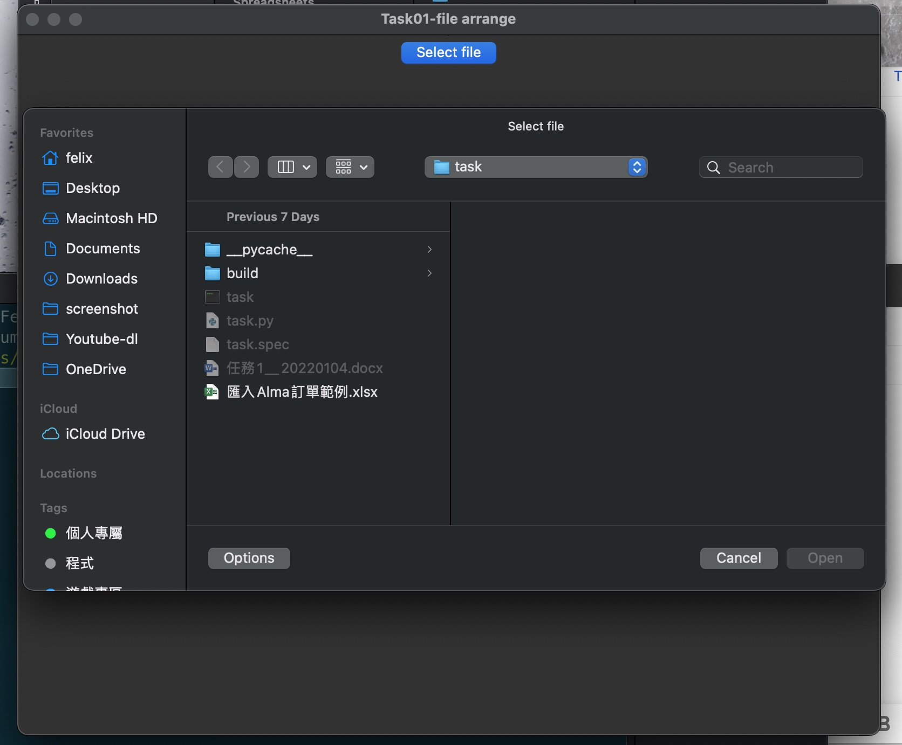
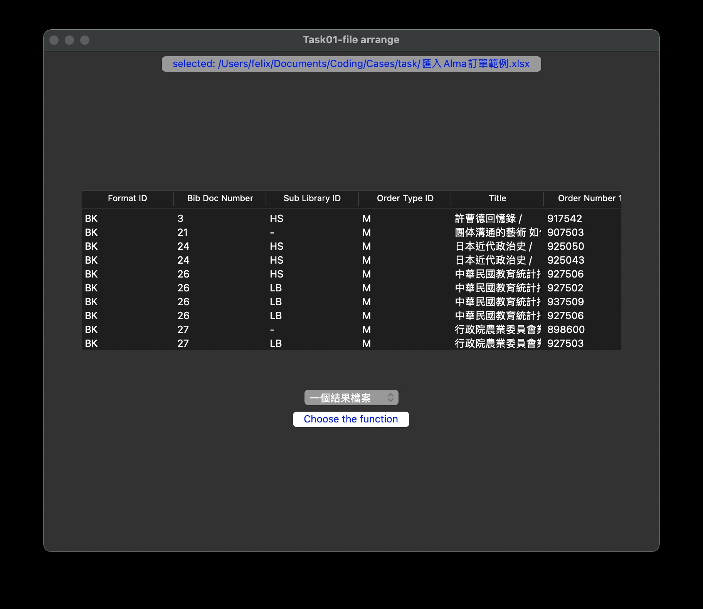
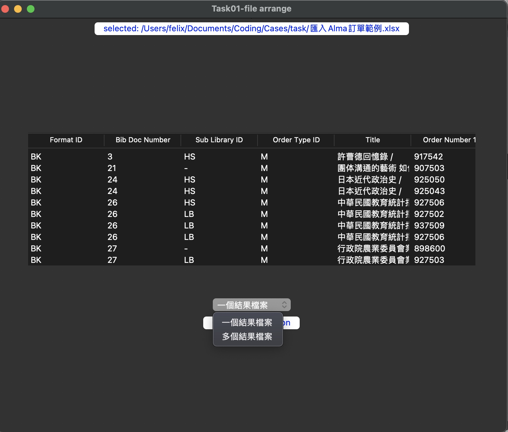
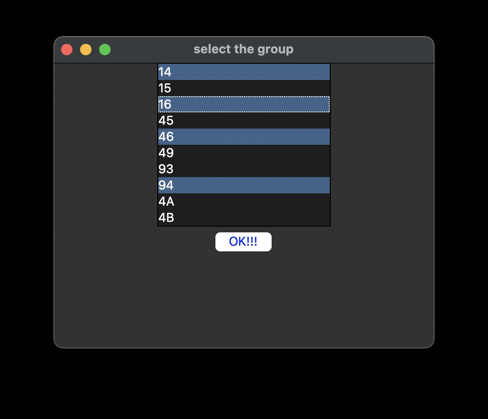
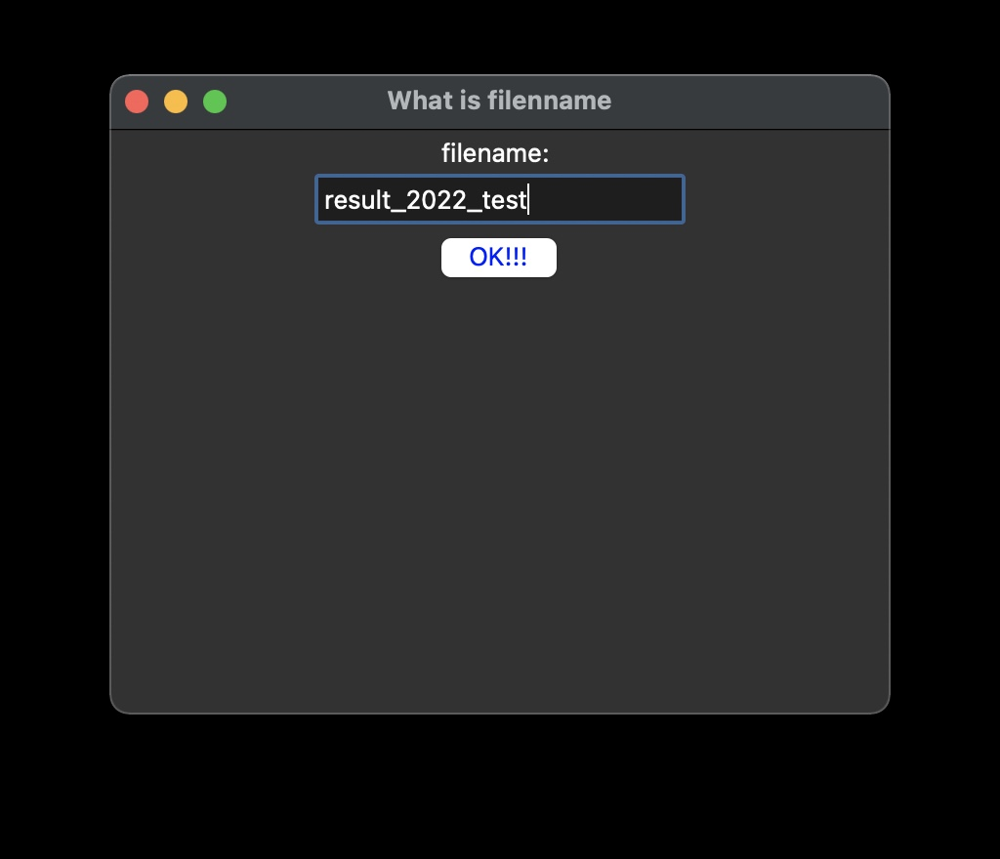
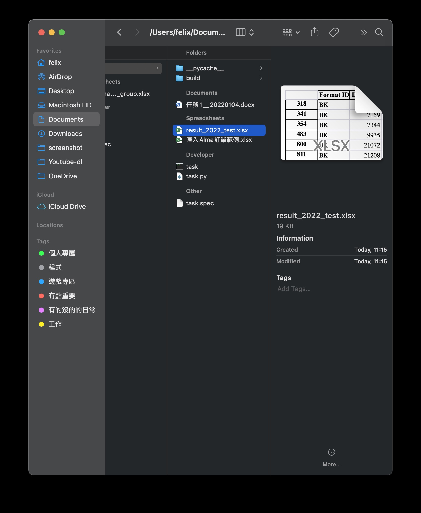
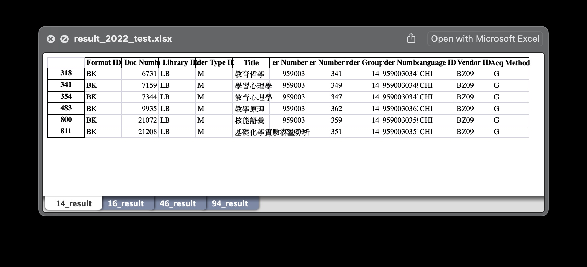

# 任務1

## 功能簡介
讀取Excel檔案並透過excel的自定義grouping做分類並另存excel檔案

## 實用教學
1. 選擇要分類的檔案
   
   
2. 檔案讀取後確認是不是所選擇的檔案

4. 選擇結果檔案的儲存方式（一個結果檔OR多個結果檔）
   
5. 選擇要分類的目標group ID
   
6. 輸出檔案的名稱（一個結果檔適用） 
   
7. 輸出DONE
   
   
   
